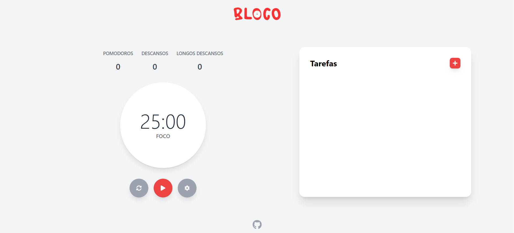

# 🍅 Bloco - Pomodoro Timer & To-Do List


## 📋 Sobre o Projeto
O **Bloco** é uma **aplicação web de produtividade** desenvolvida para ajudar estudantes e profissionais a manterem o foco e gerenciarem suas tarefas de forma eficiente. **A ferramenta une a clássica Técnica Pomodoro com uma lista de tarefas (To-Do List) interativa**, criando um ambiente completo para sessões de estudo e trabalho.

Este projeto foi construído como parte do meu **aprendizado em desenvolvimento front-end**, focando em criar uma aplicação de uso real, com persistência de dados e uma interface limpa e responsiva.

## ✨ Funcionalidades
* **Timer Pomodoro Cíclico:**
    * Ciclos de Foco, Descanso Curto e Descanso Longo totalmente automatizados.
    * Configurações de tempo personalizáveis pelo usuário.
    * Alertas sonoros para indicar o fim de cada ciclo.

* **To-Do List Interativa:**

    * Adicionar, editar, deletar e marcar tarefas como concluídas.

* **Persistência de Dados:**

    * As configurações de tempo e a lista de tarefas são salvas no localStorage, mantendo os dados do usuário mesmo após fechar o navegador.

* **Design Responsivo:**

    * Interface totalmente adaptável para uso em desktops, tablets e celulares.

## 🛠️ Tecnologias Utilizadas

* **React**: Biblioteca principal para a construção da interface de usuário.

* **Vite**: Ferramenta de build para um desenvolvimento rápido e otimizado.

* **Tailwind CSS**: Framework de estilização para a criação de um design moderno e responsivo.

* **Tone.js**: Biblioteca para a geração de alertas sonoros diretamente no navegador.

* **React Icons**: Para a utilização de ícones consistentes na interface.

## 🚀 Como Rodar o Projeto
Para rodar este projeto localmente, siga os passos abaixo:

1. Clone o repositório:

```bash
git clone https://github.com/guimael36/bloco-app.git
```

2. Navegue até o diretório do projeto:

```bash
cd bloco
```

3. Instale as dependências:

```bash
npm install
```

4. Inicie o servidor de desenvolvimento:

```bash
npm run dev
```

5. Abra seu navegador e acesse http://localhost:5173 (ou o endereço indicado no terminal).

## 👨‍💻 O que eu aprendi
Construir o Bloco foi uma jornada de aprendizado intensa. Os principais conceitos que solidifiquei foram:

* **Gerenciamento de Estado com useState**: Controle de timers, listas, configurações e visibilidade de componentes.

* **Ciclo de Vida e Efeitos com useEffect**: Manipulação de timers (setInterval), salvamento de dados e reação a mudanças de estado.

* **Componentização**: Divisão da interface em componentes reutilizáveis (PomodoroTimer, ToDoList, ConfiguracoesModal).

* **Comunicação entre Componentes**: Passagem de estado e funções via props.

* **Renderização Condicional**: Exibição de diferentes elementos da interface com base no estado da aplicação.

* **Manipulação de Formulários**: Criação de "componentes controlados" para os inputs de configuração.

* **Persistência de Dados com localStorage**: Salvamento e recuperação de dados do usuário.

* **Design Responsivo com Tailwind CSS**: Utilização de uma abordagem "Mobile-First" e breakpoints para adaptar o layout a diferentes tamanhos de tela.

Desenvolvido por **Guilherme Amaral**.